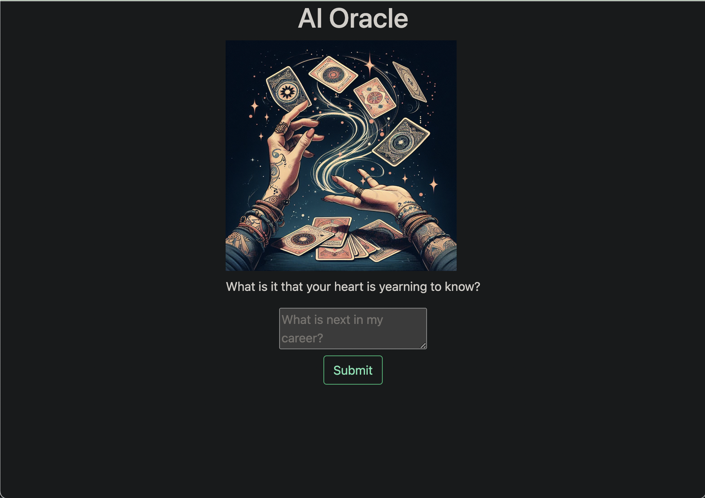

# AI Oracle

This is an app that uses the ChatGPT API to read your future

## Dependencies & Frameworks

This app uses the Bootstrap UI and OpenAI dependency. 

## Instructions

To use this application, create an API key with [OpenAI](https://openai.com/). Make sure to type npm i in the terminal and then run the server from the root folder with node server.js. Copy and paste the following commands if you wish:

```
npm i
node server.js
```

The server should be running on [localhost:3001](http://localhost:3001/)

## Screenshot & Demo Video

The following is a screenshot of my application:



This image was generated with the BING Image Generator. 


## Credits

My code is roughly based on some of the code in this video about an [AI movie pitch generator](https://www.freecodecamp.org/news/build-ai-apps-with-chatgpt-dall-e-and-gpt-4/). But I also used ChatGPT to help me work out some bugs with the API and error messages. 
